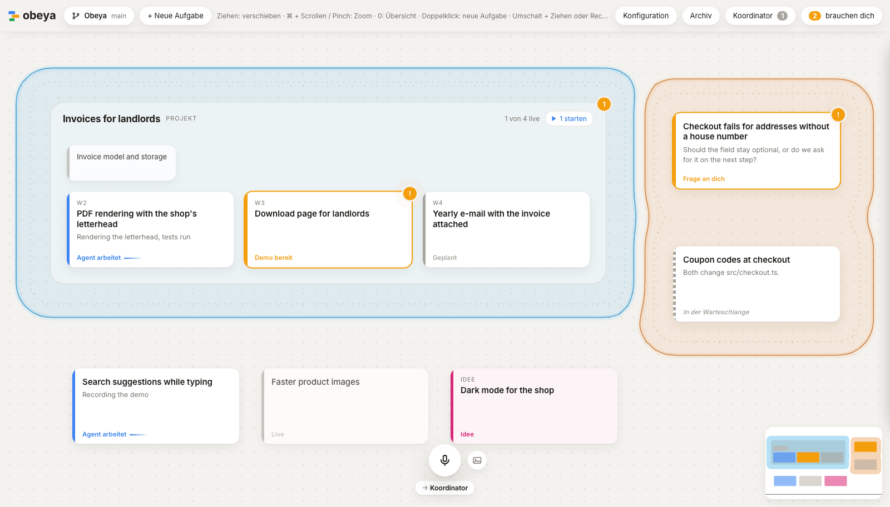

<h1>
  <picture>
    <source media="(prefers-color-scheme: dark)" srcset="src/ui/logo/wordmark-dark.svg">
    
  </picture>
</h1>

A spatial workspace for directing AI coding agents the way an engineering director directs a
team. Every task and every project is a card on one canvas. Agents do the work in the
background; you keep every essential decision — made by voice, from a narrated demo of the
finished work, without reading code or cycling through terminals.

*Obeya* is Japanese for "big room": in lean management, the room where every project hangs
visibly on the walls. More on [obeya.si](https://obeya.si).



Each card gets its own agent (Claude Code) in its own clone or worktree of your repository. The
agent asks on the card when it needs a decision and hands over with a narrated demo video of the
change; you approve it or say what to change, and approved work lands on `main` or goes out as a
pull request that Obeya carries to the merge. A Koordinator takes spoken or typed instructions,
queues cards whose changes would collide, cuts large ones into parallel packages and learns your
preferences. Larger work is planned in plan docs in the repository, which show as projects with a
card per workstream.

**Status:** early, and in daily use: Obeya is built with Obeya. The interface is German for now;
English is next. How it works and why is in [`docs/design.md`](docs/design.md).

## Requirements

- [Bun](https://bun.sh) 1.3 or newer.
- [Claude Code](https://claude.com/claude-code), installed and logged in. Obeya starts it for every agent;
  the agents run on your own login.
- git, and the [GitHub CLI](https://cli.github.com) (`gh`, logged in) for repositories whose work
  lands through pull requests.
- For demos: Node.js 22.18 or newer, a Chromium browser, ffmpeg and uv. The settings in the app
  show what is missing and how to install it; see [`docs/demo-setup.md`](docs/demo-setup.md).
- For voice: ffmpeg and uv. Whisper hears the commands (MLX on Apple Silicon, faster-whisper
  elsewhere, on an NVIDIA GPU with CUDA or on the CPU), the macOS voice or Piper speaks the
  confirmations. The settings in the app ("Voice") show what is missing and install the rest.
  Everything else works without it.

## Quick start

```bash
git clone https://github.com/sadilek/obeya.git
cd obeya
bun install
bun start ~/dev/shop            # your repository; then open http://127.0.0.1:4417
```

On the canvas, double-click to write a task, then start its agent ("Agent starten"). The card
shows what the agent is doing; when it waits for you ("brauchen dich" in the top bar), open it to
answer a question or watch the demo and approve it ("Freigeben").

## Running

```bash
bun start ~/dev/shop ~/dev/shop-web --name Shop   # one canvas, two repositories
bun start                       # the canvases in ~/.obeya/canvases.json (see src/server/main.ts)
bun start --config other.json   # those of another file
bun run dev ~/dev/shop          # same, with hot reload
bun test && bun run typecheck
```

Options: `--port <n>` (or `OBEYA_PORT`), `--adapter <name>` to override the one picked from the
`origin` URL, `--workspace <path>` (repeatable) or `--clones <n>` for adapters whose workers use
clones, `--permission-mode <mode>` for workers (default `auto`). Data and worktrees live in
`~/.obeya/` (`OBEYA_HOME` to move it). Workers run on the Claude Code login of the machine.
The canvases and their repositories can be seen and changed in the app ("Konfiguration") or by
telling the Koordinator; saving writes `canvases.json` and restarts Obeya with it.

Voice runs Whisper in a sidecar through `uv run` (mlx-whisper on Apple Silicon, faster-whisper
elsewhere), or in a Python of your own with that package (`OBEYA_WHISPER_PYTHON=/path/to/python`).
Off the Mac the confirmations are spoken by Piper, which the settings install into Obeya's home;
`OBEYA_WHISPER_BACKEND=faster` and `OBEYA_SPEECH=piper` choose those on a Mac too. Demos are recorded by the skill in
`plugin/`, which Obeya gives its workers; what a machine needs for them (Node, a browser, ffmpeg,
uv, a voice) is in [`docs/demo-setup.md`](docs/demo-setup.md), checked in the app's settings.

## Contributing

How Obeya itself is built, with Obeya, is in [`CONTRIBUTING.md`](CONTRIBUTING.md).

## License

[MIT](LICENSE), © Daniel Sadilek.
